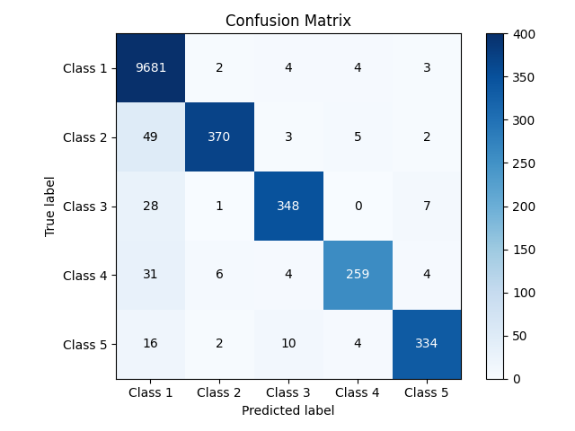
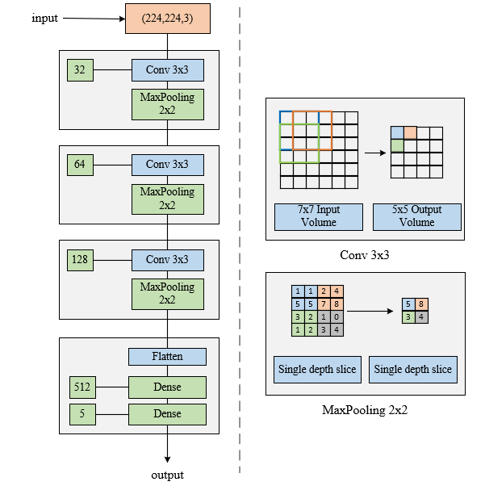
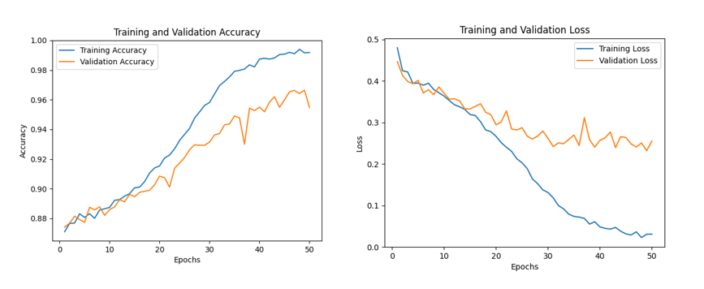
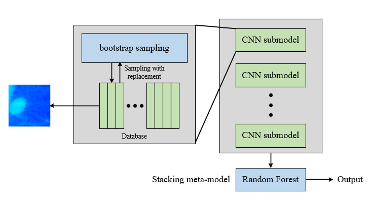

# BSECNN: High Performance Classifier for Breast Cancer

##### We use a novel Ensemble Learning approach to classify the 5 different types of breast cancer.

Paper:  https://ieeexplore.ieee.org/document/10319517

Abstract—*This paper proposes a CNN classification  network based on Bagging and stacking ensemble learning  methods for breast cancer classification. The model was  trained and tested on the public dataset of DDSM. The  model is capable of fast and accurate classification of input  images. According to our research results, for binary  classification (presence or absence of breast cancer), the  accuracy reached 98.84%, and for five-class classification,  the accuracy reached 98.34%. The model also achieved a  micro-average recall rate of 94.80% and an F1 score of  94.19%. In comparative experiments, we compared the  effects of different values of bagging_ratio and n_models on  the model, as well as several methods for ensemble bagging  models. Furthermore, under the same parameter settings,  our BSECNN outperformed VGG16 and ResNet-50 in terms  of accuracy by 8.22% and 6.33% respectively. Keywords—breast cancer classification, CNN, bagging, stacking, VGG16, ResNet-50*

This is the Confusion Matrix: 



In this method, we use simple CNN models as sub-models:



As we can see after roughly 30 epoch, overfitting appears:

s

Then we trained 15 sub-models to enhance the network performance:



## Requirements:

- Both Linux and Windows are supported. Linux is recommended for performance and compatibility reasons.

- 64-bit Python 3.7.16 installation. We recommend Anaconda3 with numpy 1.14.3 or newer.

- We recommend TensorFlow 2.5.0 or newer , which we used for all experiments in the paper, but TensorFlow 1.x is not supported.

- One or more high-end NVIDIA GPUs, NVIDIA drivers, CUDA 11.7. To reproduce the results reported in the paper, you need an NVIDIA GPU with at least 16 GB of DRAM.  We recommend RTX 2080 or better.

  

You can install env by typing:

```
pip install -f ./requirements.txt
```


## Runs:

If you want to run the 2 classification:

```
python CNN_bagging_2.py
```

If you want to run the 5 classifications with vote:

```
python CNN_bagging_vote.py
```

If you want to run the 5 classifications with stacking enhancement:

```
python CNN_bagging_stacking.py
```


## License:

This project is licensed under the GNU General Public License v3.0 - see the [LICENSE](LICENSE) file for details or visit [GNU General Public License v3.0](https://www.gnu.org/licenses/gpl-3.0.html). The GNU GPL is a copyleft license, which means that derivative work can only be distributed under the same license terms. This is briefly summarizing GPL-3.0 license's key points, however, it is not a substitute for the license itself.


## Citation:

```
@inproceedings{PC2023StackingBagging,
  title     = {Stacking-Enhanced Bagging Ensemble Learning for Breast Cancer Classification with CNN},
  author    = {Peicheng Wu, Runze Ma, Teoh Teik Toe},
  booktitle = {2023 3rd International Conference on Electronic Engineering (ICEEM)},
  doi = {10.1109/ICEEM58740.2023.10319517},
  year      = {2023}
}
```

